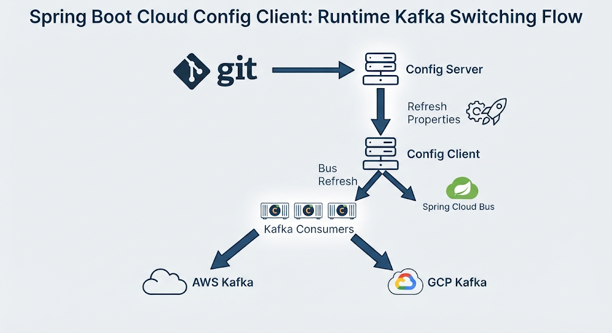

# Spring Boot Cloud Config Client

Test application for:

- Spring Cloud Config Client
- `@ConfigurationProperties`
- `@RefreshScope`
- Spring Cloud Bus
- Runtime Kafka environment switching
- RabbitMQ

## Flow



### Test endpoints

Returns topics from Config Server:

```bash
curl http://localhost:8081/app/v1/topics
```

Refresh Config Client properties:

```bash
curl -X POST http://localhost:8081/actuator/refresh
```

Refresh all connected instances through Spring Cloud Bus:

```bash
curl -X POST http://localhost:8081/actuator/busrefresh
```

Kafka consumers can switch between AWS and GCP based on the configuration stored in the Config Server, without restarting the application.

### Send message to the topics

AWS:
```bash
echo "teste" | docker exec -i kafka-aws \
  /opt/kafka/bin/kafka-console-producer.sh \
  --bootstrap-server localhost:9092 \
  --topic pagar.sorvete.seu_joao
```
GCP:
```bash
echo "teste" | docker exec -i kafka-gcp \
  /opt/kafka/bin/kafka-console-producer.sh \
  --bootstrap-server localhost:9094 \
  --topic entregar.pacoca.seu_ze
```
